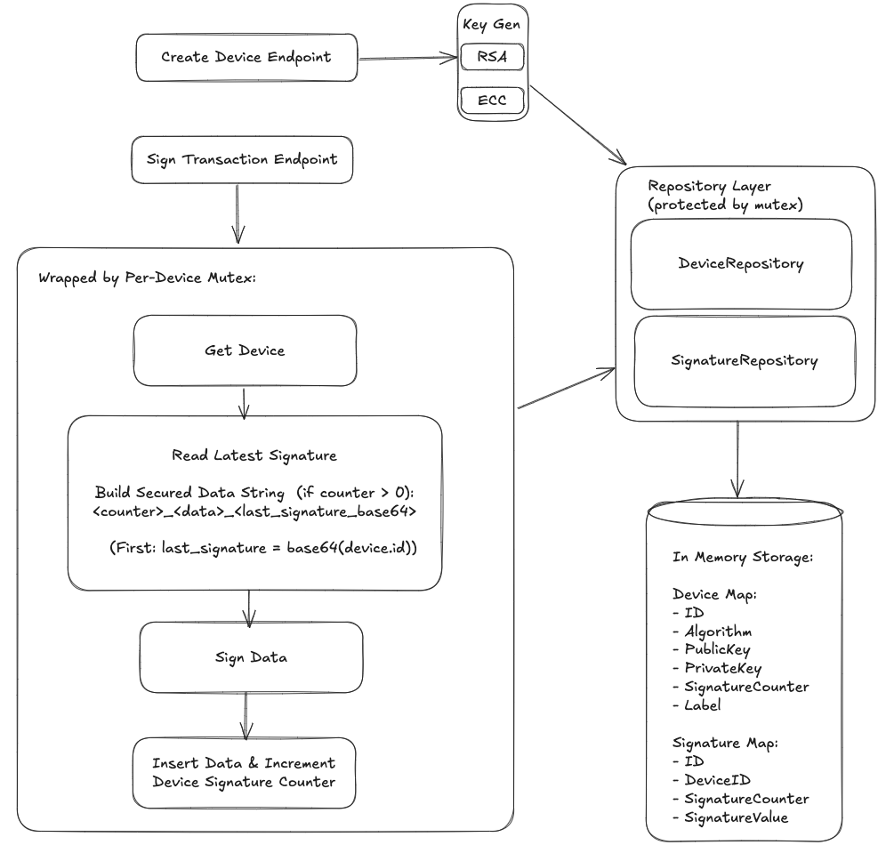

# Signature Service - Coding Challenge

## Instructions

### How to run project
```bash
# Clone the repository
git clone <repository-url>

# Install dependencies
go mod tidy

# Run the server
go run main.go
```

The server will start on `http://localhost:8080`

### Design decision and trade-offs

- Implemented layered architecture with clear separation between API, domain, crypto, and persistence layers.
- For simplicity, some domain logic is handled in the HTTP layer. In a real system, this would be separated to support multiple transports (HTTP, gRPC, WebSocket) without duplicating logic.
- Added thread safety using per-device mutexes to keep `signature_counter` strictly increasing, accepting slight performance overhead.
- Used interfaces for API and persistence to enable loose coupling and easier testing/mocking.
- Ginkgo & Gomega for Behavior-Driven Development (BDD) style tests with gomock-based repositories (mock generated using mockgen).

### API Endpoints
- `POST /api/v0/device` - Create a new signature device
- `POST /api/v0/sign-transaction` - Sign transaction data
- `GET /api/v0/devices` - List all devices
- `GET /api/v0/signatures` - List signatures by device
- `GET /api/v0/health` - Health check endpoint

#### Quick examples (curl)

Create device:
```bash
curl -sS -X POST http://localhost:8080/api/v0/device \
  -H 'Content-Type: application/json' \
  -d '{"algorithm":"RSA","label":"my-device"}'
```

Example success response:
```json
{
  "data": {
    "id": "<device-uuid>",
    "algorithm": "RSA",
    "public_key": "<pem>",
    "signature_counter": 0,
    "label": "my-device"
  }
}
```

Sign transaction:
```bash
curl -sS -X POST http://localhost:8080/api/v0/sign-transaction \
  -H 'Content-Type: application/json' \
  -d '{"device_id":"<device-uuid>","data":"hello"}'
```

Example success response:
```json
{
  "data": {
    "signature": "<base64_signature>",
    "signed_data": "0_hello_<base64_device_id_or_previous_signature>"
  }
}
```

List devices:
```bash
curl -sS http://localhost:8080/api/v0/devices
```

List signatures for a device:
```bash
curl -sS "http://localhost:8080/api/v0/signatures?device_id=<device-uuid>"
```

Health check:
```bash
curl -sS http://localhost:8080/api/v0/health
```

For more details, you can refer to a Postman collection.

### Assumptions and known limitations

**Assumptions:**
- In-memory storage is sufficient for the challenge scope, data will be erased once the service restarted.
- Algorithm support limited to RSA and ECDSA

**Known Limitation**

- In memory operations are not atomic (easy to get race condition), thus protected by mutex.
 - Single process; no horizontal scaling or distributed locking is implemented.
 - No persistence beyond process lifetime, restarting wipes data.
 - No authentication, authorization, rate limiting, or audit logging.
 - No environment variables, hardcoded localhost port 8080.

### Approximate time spent

**Total Time: 16 hours**

Breakdown:
- **Setup & Conceptual Understanding**: 2 hours
- **Core Implementation**: 6 hours
- **Writing Unit test**: 4 hours
- **Bug Fixes & Code Cleanup**: 4 hours

**Areas that took longer than expected:**
- Thread safety implementation and testing
- Setting up proper test mocks and interfaces

### Testing
```bash
ginkgo run ./...
```

### AI Tools Used
- Cursor for auto-complete, concept understanding, implementing basic code.